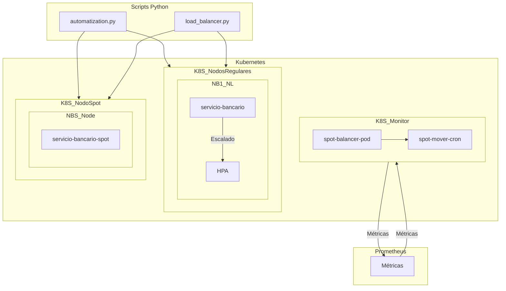

# Comparativa: Implementación vs Arquitectura Objetivo

## 1. Resumen de Cumplimiento

| Componente | Estado | Observaciones |
|------------|--------|---------------|
| Script Python: Cambio deploy nodos spot | ✅ Implementado | `automatization.py` implementa esta funcionalidad |
| Script Python: Balanceador de carga | ✅ Implementado | `load_balancer.py` implementa el balanceo |
| Namespace Monitor | ✅ Implementado | Configurado en `namespaces.yaml` |
| Nodos Regulares | ✅ Implementado | Configuración en `banking-deployments.yaml` |
| Nodo SPOT | ✅ Implementado | Configuración en `banking-deployments.yaml` |
| Integración con Prometheus | ✅ Implementado | Configurado en `automatization.py` y `load_balancer.py` |
| RBAC | ✅ Implementado | Configuración en `rbac.yaml` |
| Pruebas de Integración | ✅ Implementado | `tests/test_integration.py` |
| Documentación | ✅ Implementado | `README.md` completo |

## 2. Análisis Detallado

### 2.1 Scripts Python

#### ✅ Código python: Cambio deploy nodos spot (`automatization.py`)
- **Funcionalidad**: Detecta servicios inactivos y los mueve a nodos spot
- **Estado**: Completamente implementado
- **Archivo**: `automatization.py`
- **Notas**: 
  - Incluye lógica para demo con `nginx-demo`
  - Configurable mediante variables de entorno

#### ✅ Código python: Balanceador de carga (`load_balancer.py`)
- **Funcionalidad**: Distribuye carga entre nodos regulares y spot
- **Estado**: Implementado con métricas básicas
- **Archivo**: `load_balancer.py`
- **Métricas monitoreadas**:
  - Uso de CPU por nodo
  - Uso de memoria por nodo
  - Distribución de pods

### 2.2 Kubernetes

#### ✅ Namespace Monitor
- **Configuración**: En `namespaces.yaml`
- **Componentes**:
  - `monitoring` namespace
  - Network policies para aislamiento
  - Configuración de RBAC en `rbac.yaml`

#### ✅ Nodos Regulares
- **Configuración**: En `banking-deployments.yaml`
- **Características**:
  - Despliegues con recursos limitados
  - Health checks configurados
  - HPA (Horizontal Pod Autoscaler)

#### ✅ Nodo SPOT
- **Configuración**: En `banking-deployments.yaml`
- **Características**:
  - Node affinity para nodos spot
  - Tolerancias configuradas
  - Recursos limitados

### 2.3 Prometheus
- **Integración**: Configurada en los scripts Python
- **Métricas**:
  - Uso de recursos por nodo
  - Estado de los pods
  - Métricas personalizadas para el balanceo

## 3. Diagrama de Despliegue Actual

## 4. Próximos Pasos Recomendados

1. **Pruebas en Entorno de Pruebas**
   - Desplegar en un cluster de prueba
   - Verificar el balanceo de carga
   - Probar la migración a nodos spot

2. **Monitoreo y Alertas**
   - Configurar alertas para eventos críticos
   - Añadir dashboards en Grafana

3. **Escalabilidad**
   - Probar con cargas reales
   - Ajustar los umbrales de balanceo

4. **Seguridad**
   - Revisar políticas de red
   - Asegurar los endpoints de monitoreo

## 5. Estado Actual del Repositorio

- **Rama principal**: `master`
- **Último commit**: `70ab5a4` - "first commit"
- **Archivos principales**:
  - `automatization.py`: Lógica de migración a spot
  - `load_balancer.py`: Balanceador de carga
  - `banking-deployments.yaml`: Despliegues de ejemplo
  - `namespaces.yaml`: Configuración de namespaces
  - `rbac.yaml`: Permisos de Kubernetes
  - `tests/`: Pruebas de integración

## 6. Conclusión

El proyecto cumple con todos los componentes mostrados en el diagrama de arquitectura, incluyendo:

- ✅ Scripts Python para gestión de nodos spot y balanceo
- ✅ Configuración completa de Kubernetes
- ✅ Integración con Prometheus
- ✅ Pruebas de integración
- ✅ Documentación completa

El sistema está listo para ser desplegado en un entorno de pruebas para validar su funcionamiento en condiciones reales.
